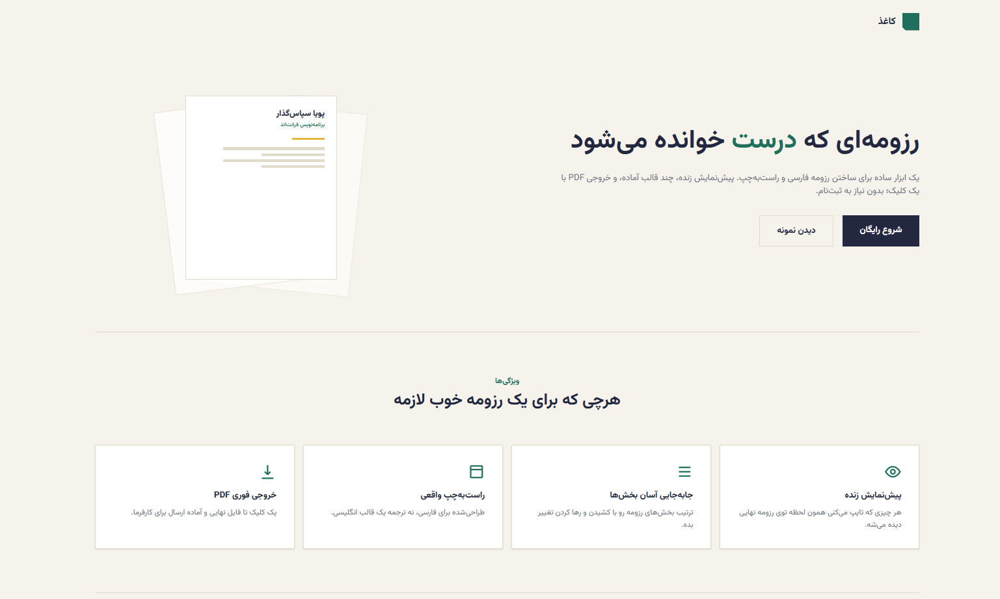
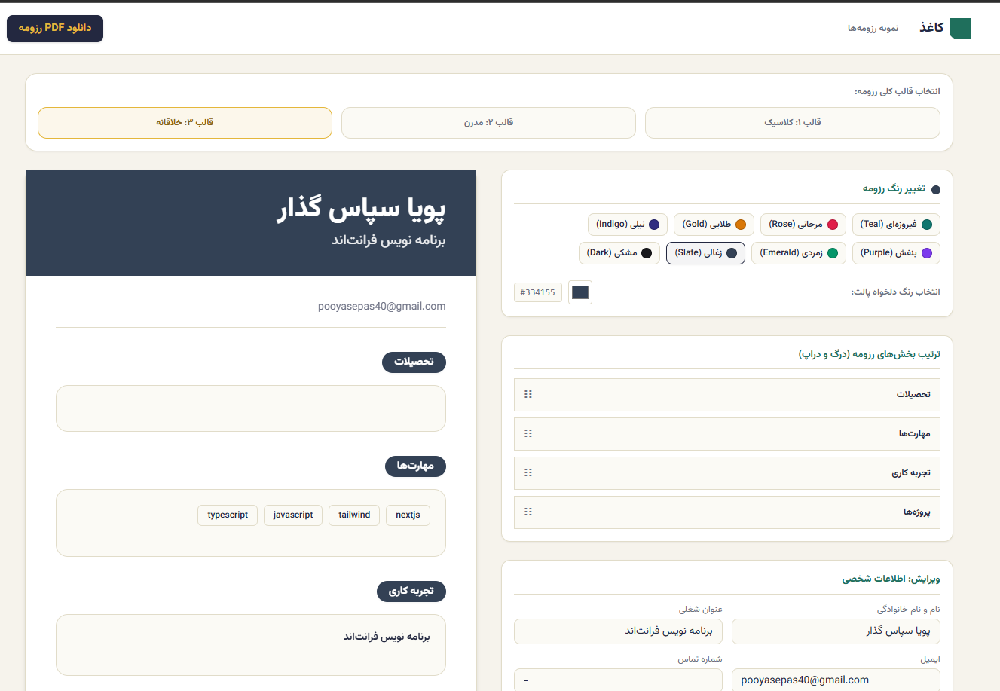

# 📄 کاغذ (Kaqaz)

**کاغذ** یک رزومه‌ساز فارسی مدرن است که به شما کمک می‌کند تنها در چند دقیقه، رزومه‌ای حرفه‌ای و زیبا ایجاد کنید.

این پروژه با تمرکز بر سادگی، سرعت و تجربه کاربری مناسب طراحی شده و با ارائه قالب‌های متنوع، امکان ساخت رزومه‌ای متناسب با سلیقه و نیاز هر کاربر را فراهم می‌کند.

---

## ✨ امکانات

- 🇮🇷 رابط کاربری کاملاً فارسی و راست‌چین (RTL)
- 🎨 قالب‌های متنوع و مدرن برای رزومه
- ⚡ پیش‌نمایش زنده هنگام ویرایش
- 📄 خروجی مناسب برای چاپ و اشتراک‌گذاری
- 📱 طراحی ریسپانسیو برای موبایل، تبلت و دسکتاپ
- 🚀 عملکرد سریع و تجربه کاربری روان

---

## 📸 تصاویر پروژه

---

## 🛠️ تکنولوژی‌های استفاده‌شده

- Next.js
- React
- TypeScript
- Tailwind CSS

---
